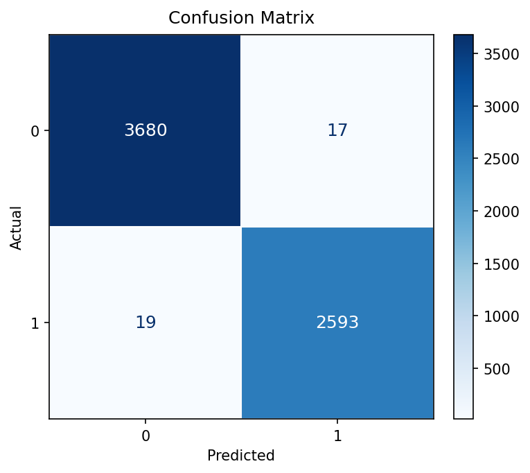
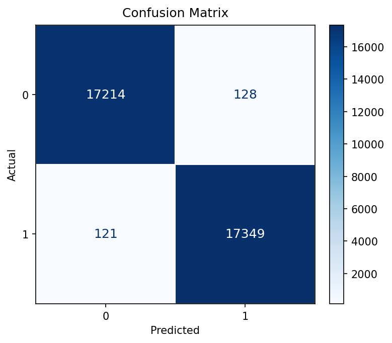

# Mental Health Text Classification

This project fine-tunes MentalBERT classifiers to detect depression-related and suicidal content in text. It includes training scripts and an evaluation script that saves a confusion matrix for each model. These models are for research and educational use, not clinical diagnosis or crisis support.

## Project Files

- `depression_model_train.py` - trains the depression classifier.
- `suicidal_model_train.py` - trains the suicidal-content classifier.
- `models_evaluation.py` - evaluates both saved models and writes `confusion_matrix_depression.png` and `confusion_matrix_suicidal.png`.
- `depression.csv`, `Suicide_Detection.csv` - datasets, expected to contain `text` and binary `label` columns.

## Evaluation
### Depression model:

### Suicidal model:

